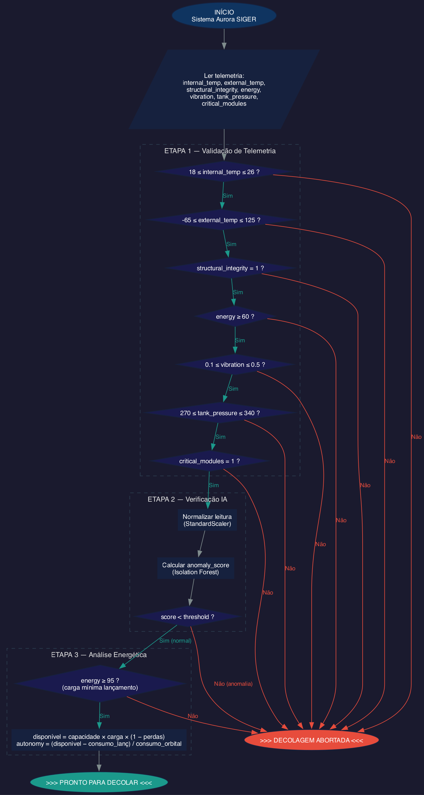

# Fluxograma do Algoritmo de Verificacao

O fluxograma acima representa o pipeline de 3 estagios do Aurora SIGER:

1. **Validacao de telemetria** — cada sensor comparado com faixas seguras
2. **Verificacao por IA** — Isolation Forest analisa combinacoes de valores
3. **Analise energetica** — autonomia orbital calculada

Somente se os tres estagios forem aprovados, o sistema emite GO.
